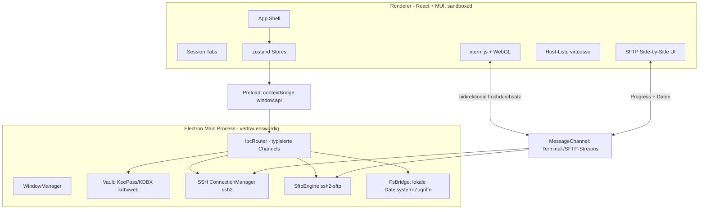
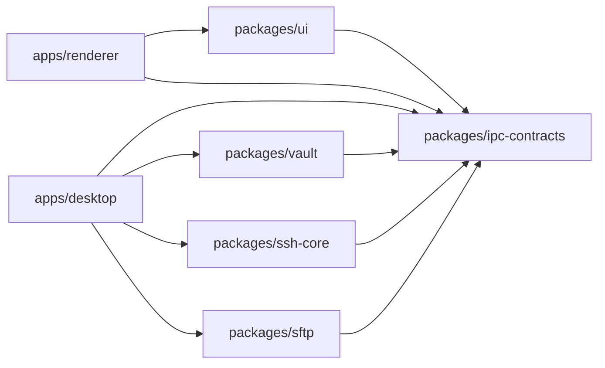

> **📌 Living Document** — Architektur-Diagramme & Datei-Struktur.
> **⚠️ Keep updated!** Bei Architekturänderungen (neue Pakete, IPC-Kanäle, Datenfluss) aktualisieren.
>
> **Purpose**: Visualisierung der SSH-Central-Architektur für Entwickler & KI.

# ARCHITECTURE.md

## Überblick

SSH Central ist eine Electron-Anwendung mit strikter Trennung zwischen **Main-Process**
(vertrauenswürdig, besitzt alle Secrets & I/O) und **sandboxed Renderer** (React UI, kein
direkter Zugriff auf Dateisystem/Netzwerk). Alle Fähigkeiten werden über typisierte IPC
exponiert.



## Datenfluss

1. **Unlock**: Renderer ruft `vault.unlock(masterPassword)` → Main entschlüsselt `vault.kdbx`
   (Argon2) → hält entschlüsselte Credentials nur im Main-Process-Speicher.
2. **Verbinden**: Renderer ruft `ssh.connect(hostRef)` → Main holt Credentials aus dem
   entschlüsselten Vault, baut ssh2-Verbindung auf, erstellt einen Terminal-Kanal.
3. **Streaming**: Terminal-/SFTP-Daten laufen über einen pro Session eröffneten
   `MessageChannel` (hoher Durchsatz), Steuer-Kommandos über die IPC-Request/Response-API.
4. **SFTP**: Renderer öffnet eine SFTP-Ansicht → Main erzeugt `SftpEngine`, liest/schreibt
   lokal über `FsBridge` und remote über ssh2-SFTP, meldet Progress via Stream.

## Paket-Grenzen & Abhängigkeiten



Regeln:
- **Nur `desktop`** darf `ssh-core`, `vault`, `sftp` als Laufzeit-Abhängigkeit importieren.
- **`renderer`** importiert ausschließlich `ipc-contracts` (Typen/Contracts) und `ui`.
- **`ipc-contracts`** enthält keinerlei Laufzeit-Logik, nur Typen & Channel-Namen.

## Typisierte IPC-Verträge (`packages/ipc-contracts`)

Zentrale `interface` je Domäne, implementiert vom Main und von `window.api` (Preload):

| Domäne | Kanal | Request → Response |
|--------|-------|--------------------|
| Vault | `vault:*` | `unlock`, `lock`, `status`, `create`, `changeMasterPassword` |
| SSH | `ssh:*` | `connect`, `disconnect`, `listSessions`, `resize`, `openChannel` |
| SFTP | `sftp:*` | `open`, `list`, `mkdir`, `rename`, `remove`, `upload`, `download`, `cancel` |
| FS | `fs:*` | `listLocal`, `mkdirLocal`, `stat` |

Ereignisse (Main → Renderer) laufen über `vault:event`, `ssh:event`, `sftp:event`.

## Datei-Struktur (Ziel)

```
apps/desktop/src/
├── main/
│   ├── index.ts            # App-Lifecycle, App-Vault-Bootstrapping
│   ├── windows.ts          # BrowserWindow-Erstellung, DevTools, Menü
│   ├── ipc/
│   │   ├── router.ts       # Registriert alle Handler
│   │   ├── vault.ipc.ts
│   │   ├── ssh.ipc.ts
│   │   ├── sftp.ipc.ts
│   │   └── fs.ipc.ts
│   └── streams/            # MessageChannel-Einrichtung für Terminal/SFTP
├── preload/
│   ├── index.ts            # contextBridge → window.api
│   └── index.d.ts          # globale Typdeklaration für window.api
apps/renderer/src/
├── main.tsx
├── App.tsx                 # Shell: Sidebar + Tab-Bereich
├── theme.ts
├── store/                  # zustand Stores (vault, sessions, sftp, hosts)
├── features/
│   ├── vault/              # Unlock-/Einrichtungs-Screen
│   ├── hosts/              # Host-Liste + Manager
│   ├── terminal/           # xterm.js-Ansicht + Tab
│   └── sftp/               # Side-by-Side File Manager
└── components/
packages/
├── vault/src/              # kdbxweb-Wrapper: create, unlock, lock, entries
├── ssh-core/src/           # ConnectionManager, SessionManager
├── sftp/src/               # SftpEngine, TransferQueue
└── ipc-contracts/src/      # Typen + Channels
```

## Security-Architektur

- Secrets leben **nur im Main-Process**, entschlüsselt aus `vault.kdbx`.
- Renderer ist `contextIsolation: true` + `nodeIntegration: false` + `sandbox: true`.
- Keine Berechtigung im Renderer auf `fs`/`net`/`child_process`.
- Auto-Lock bei Inaktivität (konfigurierbar, Default z.B. 5 min) → entschlüsselter Speicher wird überschrieben/geleert.
- Private Keys werden nur im Moment des Verbindungsaufbaus verwendet, nie persistent im Klartext gehalten.
