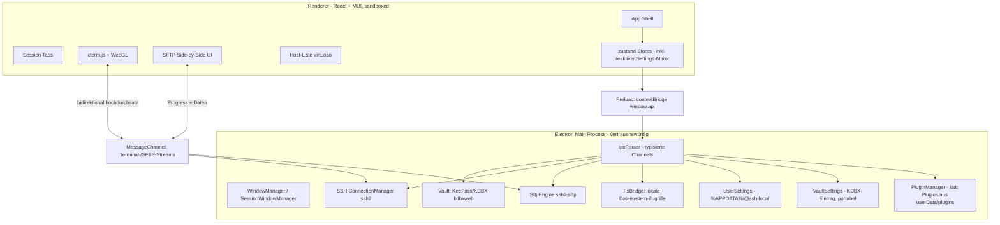
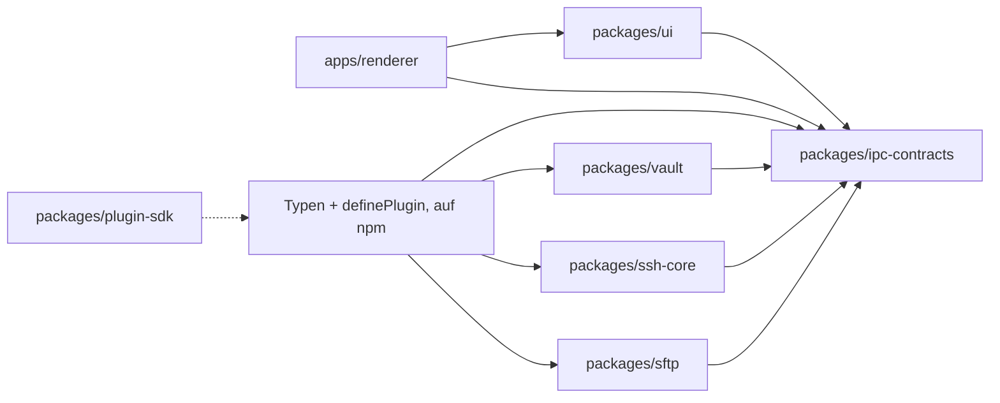

> **📌 Living Document** — Architektur-Diagramme & Datei-Struktur.
> **⚠️ Keep updated!** Bei Architekturänderungen (neue Pakete, IPC-Kanäle, Datenfluss) aktualisieren.
>
> **Purpose**: Visualisierung der SSH-Central-Architektur für Entwickler & KI.

# ARCHITECTURE.md

## Überblick

SSH Central ist eine Electron-Anwendung mit strikter Trennung zwischen **Main-Process**
(vertrauenswürdig, besitzt alle Secrets & I/O) und **sandboxed Renderer** (React UI, kein
direkter Zugriff auf Dateisystem/Netzwerk). Alle Fähigkeiten werden über typisierte IPC
exponiert.



## Datenfluss

1. **Unlock**: Renderer ruft `vault.unlock(masterPassword)` → Main entschlüsselt `vault.kdbx`
   (Argon2id) → hält entschlüsselte Credentials nur im Main-Process-Speicher. Nach dem Unlock
   werden die `VaultSettings` aus der `.kdbx` geladen, ihre Main-Wirkungen (Auto-Lock,
   SFTP-Parallelität) angewandt und der Stand an die UI gepusht.
2. **Verbinden**: Renderer ruft `ssh.connect(hostRef)` → Main holt Credentials aus dem
   entschlüsselten Vault, baut ssh2-Verbindung auf, erstellt einen Terminal-Kanal.
3. **Streaming**: Terminal-/SFTP-Daten laufen über einen pro Session eröffneten
   `MessageChannel` (hoher Durchsatz), Steuer-Kommandos über die IPC-Request/Response-API.
4. **SFTP**: Renderer öffnet eine SFTP-Ansicht → Main erzeugt `SftpEngine`, liest/schreibt
   lokal über `FsBridge` und remote über ssh2-SFTP, meldet Progress via Stream.

## Paket-Grenzen & Abhängigkeiten



Regeln:
- **Nur `desktop`** darf `ssh-core`, `vault`, `sftp` als Laufzeit-Abhängigkeit importieren.
- **`renderer`** importiert ausschließlich `ipc-contracts` (Typen/Contracts) und `ui`.
- **`ipc-contracts`** enthält das gemeinsame Settings-Schema (`SettingDefinition`,
  `sanitizeSettings`) — nur Typen & Daten, keine Main-/Renderer-Logik.
- **`plugin-sdk`** ist eigenständig (Typen + `definePlugin`-Helper + `ssh-central-plugin`-CLI),
  wird außerhalb des Monorepos installiert (file:/git-Referenz) und ist auf npm publiziert.

## Typisierte IPC-Verträge (`packages/ipc-contracts`)

Zentrale `interface` je Domäne, implementiert vom Main und von `window.api` (Preload):

| Domäne | Kanal | Request → Response |
|--------|-------|--------------------|
| Vault | `vault:*` | `unlock`, `lock`, `status`, `create`, `changeMasterPassword`, `listEntries`, `getSecret` |
| SSH | `ssh:*` | `connect`, `disconnect`, `listSessions`, `resize`, `openChannel` |
| SFTP | `sftp:*` | `open`, `list`, `mkdir`, `rename`, `remove`, `upload`, `download`, `cancel` |
| FS | `fs:*` | `listLocal`, `mkdirLocal`, `stat`, `listOpeners` |
| Settings | `settings:*` | `get`, `set` (User + Vault), Push `settings:changed` |
| Dialog | `dialog:*` | `pickFolder`, `pickFile` (native Electron-Dialoge) |
| System | `system:*` | `getStats` (CPU, RAM, GPU, Speicher für die Statusleiste) |
| Plugins | `plugins:*` | `list`, `install`, `uninstall`, `enable`, `disable`, `grantPermission`, IPC-Bridge |
| Fenster | `window:*` | `open` (Terminal/SFTP), `openPanel` |

Ereignisse (Main → Renderer) laufen über `vault:event`, `ssh:event`, `sftp:event`,
`settings:changed`. Terminal-/SFTP-Datenströme über `MessageChannel`.

## Datei-Struktur (aktuell)

```
apps/desktop/src/
├── main/
│   ├── index.ts                    # App-Lifecycle, Settings-Verdrahtung, IPC-Registrierung
│   ├── windows.ts                  # Hauptfenster + Menü
│   ├── session-windows.ts          # Separate Terminal-/SFTP-Fenster (WindowManager)
│   ├── protocol.ts                 # Custom-app://-Protocol (serviert Renderer, asar-bewusst)
│   ├── path-guards.ts              # assertSafePath / assertNotProtected
│   ├── ipc/
│   │   ├── router.ts               # Zentraler IPC-Router (alle Domänen)
│   │   ├── vault.ipc.ts, ssh.ipc.ts, sftp.ipc.ts, fs.ipc.ts
│   │   ├── hosts.ipc.ts, plugins.ipc.ts
│   │   └── types.ts
│   ├── services/
│   │   ├── settings-provider.ts    # Abstrakte Basis (Validierung + atomare Persistenz)
│   │   ├── user-settings.ts        # UserSettings → %APPDATA%/@ssh-local/user-settings.json
│   │   ├── vault-settings.ts       # VaultSettings (pro .kdbx) + VaultSettingsStorage-Interface
│   │   ├── kdbx-vault-settings-storage.ts  # KDBX-Eintrag "SSH Central App/Settings"
│   │   ├── vault-service.ts, host-store.ts, ssh-service.ts, sftp-service.ts
│   │   └── credential-resolver.ts, openers.ts
│   └── plugin/
│       ├── plugin-manager.ts       # Laden, Hooks, Events, Tabs, IPC, Secrets, Storage, Permissions
│       ├── plugin-protocol.ts      # plugin://-Protocol (serviert Plugin-UI, injiziert Bridge)
│       ├── types.ts                # PluginApi, PluginManifest, Typen
│       └── unzip.ts                # ZIP-Extraktion mit Zip-Slip-Schutz
├── preload/
│   └── index.ts            # contextBridge → window.api
apps/renderer/src/
├── main.tsx                # Theme-Provider (reaktive Theme-/Sprachwahl)
├── App.tsx                 # Shell: Routing + Settings-Initialisierung
├── store/                  # zustand Stores (vault, hosts, settings, plugins, …)
├── components/
│   └── settings/           # SettingComponent, SettingSectionComponent, SettingsRenderer
├── features/
│   ├── vault/              # VaultGate (Login/Unlock), VaultView, ChangePasswordDialog
│   ├── hosts/              # Host-Liste + Manager
│   ├── terminal/           # xterm.js-Ansicht + Tab
│   ├── sftp/               # Side-by-Side File Manager
│   ├── settings/           # UserSettingsDialog, VaultSettingsDialog
│   └── plugins/            # PluginsDialog, PluginPanel, PluginDialogHost
└── i18n/                   # de/ + en/ Woerterbuecher, useTranslation()
packages/
├── vault/src/              # kdbxweb-Wrapper: create, unlock, lock, entries, read/writeSettings
├── ssh-core/src/           # ConnectionManager (inkl. TOFU-Host-Key-Verifizierung)
├── sftp/src/               # SftpEngine, TransferQueue
├── ipc-contracts/src/      # Typen, Channels, SettingDefinition-Schema + Sanitizer
├── plugin-sdk/src/         # PluginApi-Typen, definePlugin, ssh-central-plugin-CLI
└── ui/src/                 # Geteilte React-Komponenten & Theme
```

## Security-Architektur

- Secrets leben **nur im Main-Process**, entschlüsselt aus `vault.kdbx`.
- Renderer ist `contextIsolation: true` + `nodeIntegration: false` + `sandbox: true`.
- Keine Berechtigung im Renderer auf `fs`/`net`/`child_process`.
- Auto-Lock bei Inaktivität (konfigurierbar, **Default 15 min**, 0 = nie) → entschlüsselter Speicher
  wird überschrieben/geleert.
- Private Keys werden nur im Moment des Verbindungsaufbaus verwendet, nie persistent im Klartext gehalten.
- **Settings-Trennung**: `UserSettings` (Theme, Sprache, Terminal, Debug) liegen geräteweit in
  `%APPDATA%/@ssh-local` (vor dem Unlock verfügbar); `VaultSettings` (Auto-Lock, SFTP-Parallelität,
  Datei-Openers) liegen in der `.kdbx` und reisen mit dem Vault. Beide validieren über das gemeinsame
  Schema in `ipc-contracts`; die `UserSettings` sind per Definition frei, die Vault-Settings-Secrets
  bleiben exklusiv im Vault.
- **Plugins** laufen im Main-Process (trusted) und werden try/catch-isoliert geladen; sie erweitern
  Logik, registrieren UI-Tabs (sandboxed iframe) und greifen nur mit erteilter Permission auf
  Host-Fähigkeiten zu. Details: `docs/plugin-development.md`.
