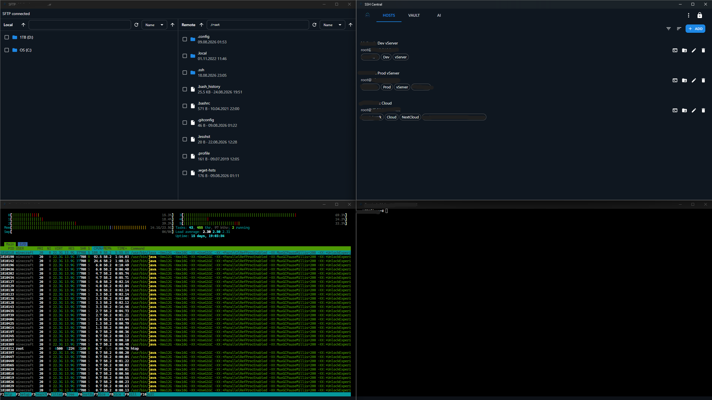

# SSH Central

> A fast, secure, open-source SSH client & SFTP file manager for **Windows** and **Linux**.

SSH Central ist ein moderner Ersatz für Termius und ähnliche (kostenpflichtige) SSH-Clients —
komplett lokal, offen und unter deiner Kontrolle. Unbegrenzt viele SSH-Hosts, parallele
Terminal-Sessions und SFTP-Dateiübertragungen in einer Side-by-Side-Ansicht — verschlüsselt
über ein KeePass-kompatibles (KDBX) Vault.

[](CHANGELOG.md)
[](LICENSE)
[](https://github.com/alexanderkochdev/ssh-central/actions/workflows/build.yml)


[](https://github.com/alexanderkochdev/ssh-central/stargazers)
[](https://github.com/alexanderkochdev/ssh-central/forks)
[](https://github.com/alexanderkochdev/ssh-central/issues)
[](https://github.com/alexanderkochdev/ssh-central/pulls)
[](https://github.com/alexanderkochdev/ssh-central/graphs/contributors)
[](https://github.com/alexanderkochdev/ssh-central/commits/develop)

| | |
|---|---|
| **Autor** | Alexander Koch — https://www.alexanderkoch.dev/ |
| **Lizenz** | [GPL-3.0](LICENSE) (OSI Open Source, Copyleft) |
| **Stack** | Electron · React · Material UI · TypeScript · pnpm + Turborepo |
| **Plattformen** | Windows 10/11 · Linux (AppImage/deb) |
| **Status** | **v1.4.0** — Automatische Updates (GPL-3.0 Open Source) |

---

## Download

Lade die aktuelle Version von den [GitHub Releases](https://github.com/alexanderkochdev/ssh-central/releases) herunter
(Windows-Installer `.exe`, Linux AppImage/deb). Alle Secrets bleiben lokal in deinem
KeePass-kompatiblen Vault. Die Windows-Installation und das AppImage aktualisieren sich danach
**aus der App heraus** — ein manueller Download pro Version ist nicht nötig.

---

## Features

- **Sicherer Tresor (KeePass/KDBX)** — SSH-Keys und Benutzername/Passwort verschlüsselt in
  einer `.kdbx`-Datei, entsperrbar mit einem selbst gewählten Master-Passwort (Argon2id KDF).
  Kompatibel mit KeePassXC. Auto-Lock nach Inaktivität, Master-Passwort-Wechsel.
- **Host-Manager** — Unbegrenzt viele Hosts, Gruppen, Tags; schnelle Suche, Filter &
  Sortierung; Passwort- oder Key-Auth (Secrets referenzieren den Vault, nie Klartext).
- **Terminal** — Parallele SSH-Sessions mit xterm.js (WebGL-beschleunigt), Tabs, Reconnect.
  Sessions frei **benennbar + farbcodiert** (Farb-Leiste + Akzent im Fenster).
- **SFTP File Manager** — Side-by-Side-Ansicht (lokal ↔ remote), Drag & Drop, Transfer-Queue
  mit konfigurierbarer Parallelität, Progress, Abbrechen; Dateien mit beliebigen Programmen öffnen.
- **Multi-Host Command Runner** — ein Kommando **parallel auf mehreren Hosts** ausführen,
  Exit-Code + Output nebeneinander vergleichen, alle Ausgaben kopieren.
- **Command Palette (Strg+P)** — durchsuche Hosts, Tresor-Einträge und Aktionen per fuzzy-Suche.
- **Clipboard-Guard** — kopierte Vault-Passwörter werden nach konfigurierbarer Zeit (Standard 10 s)
  automatisch aus der Zwischenablage entfernt — mit expliziter Bestätigung vor dem Kopieren.
- **Automatische Updates** — die App prüft beim Start nicht-blockierend auf neue GitHub-Releases,
  lädt das Update auf Wunsch direkt in der App herunter (Windows-Installation & Linux-AppImage)
  und installiert es mit einem Neustart. Bei `.deb`-Installationen führt der Weg bewusst zum
  Paketmanager bzw. zur Release-Seite. Details: [docs/releases.md](docs/releases.md).
- **Schema-getriebenes Settings-System** — `UserSettings` (geräteweit) + `VaultSettings`
  (pro `.kdbx`, portabel), rendern über generische UI-Bausteine.
- **Plugins** — ZIP-installierbare Plugins (UI, IPC, Dialoge, Secrets, Persistenz,
  Berechtigungen, Host-Fähigkeiten), entwickelt mit dem
  [Plugin-SDK](docs/plugin-development.md) (`@ssh-central/plugin-sdk`).
- **i18n** — Vollständige DE/EN-Unterstützung.
- **Performance** — Streaming über `MessageChannel`, virtualisierte Listen, native Module,
  ressourcenschonender Main-Process.

Siehe [docs/roadmap.md](docs/roadmap.md) für die Roadmap und [docs/security.md](docs/security.md)
für das Security-Design. Build, Release und Auto-Update: [docs/releases.md](docs/releases.md).

---

## Screenshots

Vier Fenster im Einsatz: Hauptfenster, SFTP-Dateimanager und zwei parallele Terminal-Sessions.



---

## Monorepo-Struktur

```
local-ssh-central/
├── apps/
│   ├── desktop/          # Electron Main + Preload (Node-Kontext, verbindet alles)
│   └── renderer/         # React + Material UI Frontend (Vite, sandboxed)
├── packages/
│   ├── ssh-core/         # ssh2: Verbindungs- & Session-Manager (nur Main-Process)
│   ├── sftp/             # SFTP-Transfer-Engine (Queue, Parallelität, Resume)
│   ├── vault/            # KeePass/KDBX-Tresor (kdbxweb), AES+Argon2
│   ├── ipc-contracts/    # Typisierte IPC-Verträge & geteilte Types
│   ├── plugin-sdk/       # SDK für Plugins (typisierte API, definePlugin, CLI) — auf npm
│   └── ui/               # Geteilte React-Komponenten & Theme
├── examples/             # Beispiel-Plugins
├── docs/                 # Roadmap, Plugin-Entwicklung, Security-Design, Release/CI-CD
└── package.json          # pnpm + Turborepo Root
```

Detailierte Architektur: [ARCHITECTURE.md](ARCHITECTURE.md)

---

## Voraussetzungen

- [Node.js](https://nodejs.org) ≥ 24
- [pnpm](https://pnpm.io) ≥ 11 (`npm i -g pnpm`)
- [Git](https://git-scm.com) ≥ 2.40

## Schnellstart (Entwicklung)

```bash
pnpm install        # installiert alle Workspace-Abhängigkeiten
pnpm dev            # startet Electron + Renderer (Hot Reload)
pnpm build          # baut alle Pakete + Apps
pnpm package        # erstellt Installer (Windows NSIS / Linux AppImage+deb)
```

## Git-Workflow

Standard-Branch ist **`develop`** (Integrationsbranch). Features kommen über
`feature/*`-Branches herein; Releases werden einzeln über `release/x.y.z`-Branches
geschnitten, auf `main` gemerged und als `vx.y.z`-Tag veröffentlicht. Der Tag-Push
baut die Installer in der CI und legt die GitHub-Release automatisch an.

Details: [docs/releases.md](docs/releases.md) (Release, CI/CD, Auto-Update) ·
[docs/roadmap.md](docs/roadmap.md#git-workflow) (Branch-Modell)

---

## Mitmachen

Beiträge sind willkommen. Bitte:

1. [CONTRIBUTING.md](CONTRIBUTING.md) lesen (Branching, Commits, Tests, PR-Prozess).
2. Conventional Commits (`feat:`, `fix:`, `refactor:`, …) verwenden.
3. `pnpm verify` grün halten (Typecheck, Lint, Coverage, Build — ohne Turbo-Cache)
   (inkl. Coverage-Thresholds, siehe [CONTRIBUTING.md](CONTRIBUTING.md)).
4. Alle Änderungen an `CHANGELOG.md`, `AGENTS.md` & `ARCHITECTURE.md` spiegeln.
5. Keine Secrets/`.kdbx`-Dateien committen — siehe `.gitignore`.

Verhaltenskodex: [CODE_OF_CONDUCT.md](CODE_OF_CONDUCT.md).

## Sicherheit

Melde Sicherheitslücken nicht öffentlich — siehe [SECURITY.md](SECURITY.md)
(verantwortungsvolle Offenlegung). Security-Design: [docs/security.md](docs/security.md).

---

## Lizenz

SSH Central ist unter der **GNU General Public License v3.0** lizenziert — siehe
[LICENSE](LICENSE). Copyright © 2026 **Alexander Koch**.
